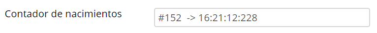
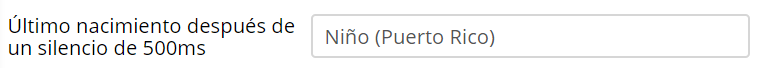
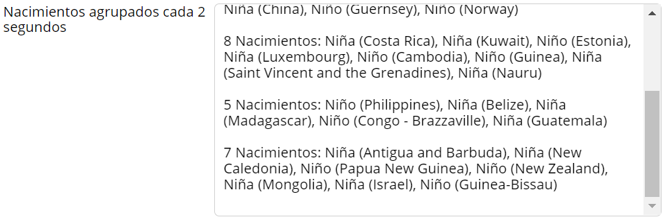
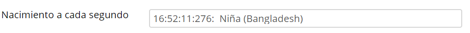
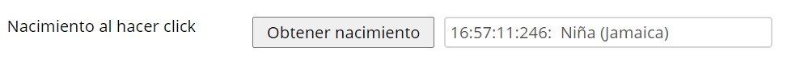
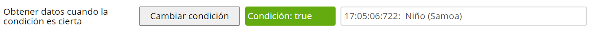

# Event/Back pressure

## Introducción

El fenómeno conocido como event o back pressure es algo que sucede desde hace relativamente pocos años. Con el auge de redes sociales, miles de
dispositivos nuevos con sus push notifications, el IoT y el marketing online; Big Data en resumidas cuentas, los datos que se mueven por segundo en el
mundo son imposibles de cuantificar.

Al programar sistemas orientados a estos escenarios debemos tener en cuenta que estos tipos de flujos masivos y con latencia variable pueden acabar
colapsando nuestro sistema, sea back, front o middle, no es algo que afecte a un solo ámbito.

Si queremos crear sistemas para la gestión masiva de datos y que su respuesta sea adecuada, debemos aplicar técnicas de back pressure: Lossy,
loss-less o de filtrado.

## Reto

Implementaremos un sistema que **simula** los nacimientos que van sucediendo en el mundo. Mediante la interface Birth iremos representando datos de
nacimientos: sexo y ciudad.

### Definiciones

```typescript
export enum Gender {
    Boy = 'Niño',
    Girl = 'Niña'
}

export type Country = string;

export interface Birth {
    country: Country;
    gender: Gender;
}
```

### Streams

Tenemos varios streams para realizar el ejercicio, los iremos descubriendo a cada ejercicio propuesto.

El único stream que necesitamos conocer por ahora es el
`eventPressure$`: este stream genera valores en tiempos variables (entre 0 y 600 ms), que son convertidos a objetos Birth aleatorios.
**No debe ser modificado!!**

## Ejercicios

### 1. Contador de nacimientos

Hacer que en el campo de texto referente al contador de nacimientos vaya apareciendo el contador con su timestamp, tal que así:
<br>


* El campo html es el declarado en el fichero app.ts como `eventCounter`
* Este campo, si se ha hecho bien, debe cambiar de valor constantemente

----

### 2. Último nacimiento después de un silencio en la recepción de los eventos

Hacer que en elemento html llamado `silence` aparezca el último nacimiento recibido después de un silencio de medio segundo, es decir, si van llegando
eventos, hasta que no haya un espacio de tiempo entre dos consecutivos de medio segundo, no emitirá. La pantalla debería quedar así:
<br>

* Este campo debe cambiar lentamente, si se ha hecho bien

----

### 3. Agrupación de eventos

Puesto que los datos que se reciben son muchos, se precisa empaquetar los eventos en periodos de dos segundos, es decir, agruparlos cada dos segundos
y mostrarlos en el campo llamado `grouping`, tal que así:

<br>

* Tenemos que ir concatenando los resultados, no sustituirlos.

----

### 4. Primer nacimiento de cada segundo

Mostrar el primer nacimiento de cada segundo, algo así:

<br>


----

### 5. Obtener el nacimiento en el momento del click

Mostrar el primer nacimiento que se ha emitido justo en el momento en el que hacemos click en el botón [Obtener nacimiento]:

<br>

* Los clicks del botón están referenciados con la variable `lastEmittedEventButtonClick$`.
* Se debe actualizar el input referenciado con la variable `last`.

----

### 6. Mostrando eventos según condición

Se precisa mostrar los eventos que se van recibiendo solo si la condición es cierta, es decir, inicialmente, ya que la condición es false, el campo de
texto debe ser vacío. A la que pulsemos el botón, se alterna el valor de la condición y se empezarán a recibir. El botón hace de interruptor para
determinar cuando queremos recibir datos.

<br>

* El valor del estado de la condición está albergado en el subject `condition$`
* Se tiene que ir actualizando el elemento html llamado `byCondition`

---

## NOTA:

No es un ejercicio complicado. Si veis que tenéis que hacer muchas 'locuras' es que algo no va bien.  
Mi solución (de todos los ejercicios), incluyendo algunos comentarios y saltos de línea, son 40 líneas.

---
